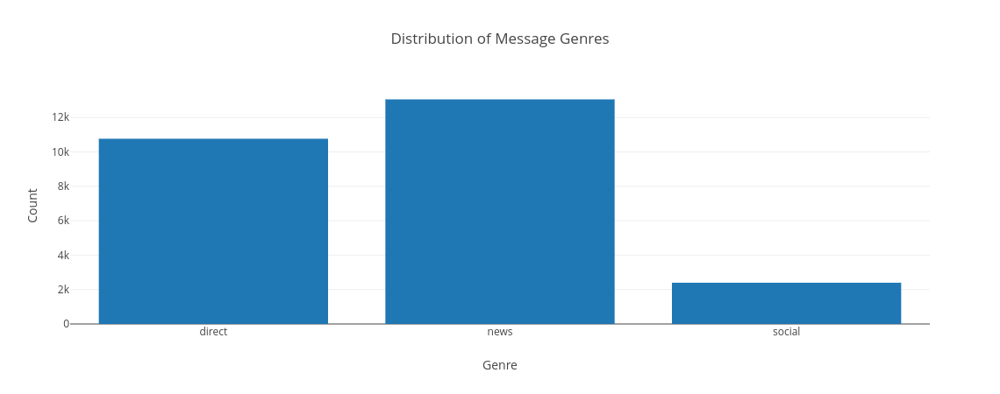
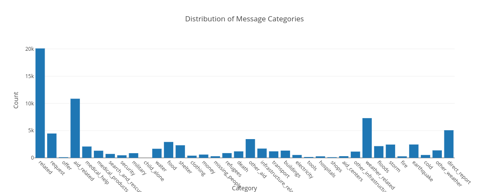
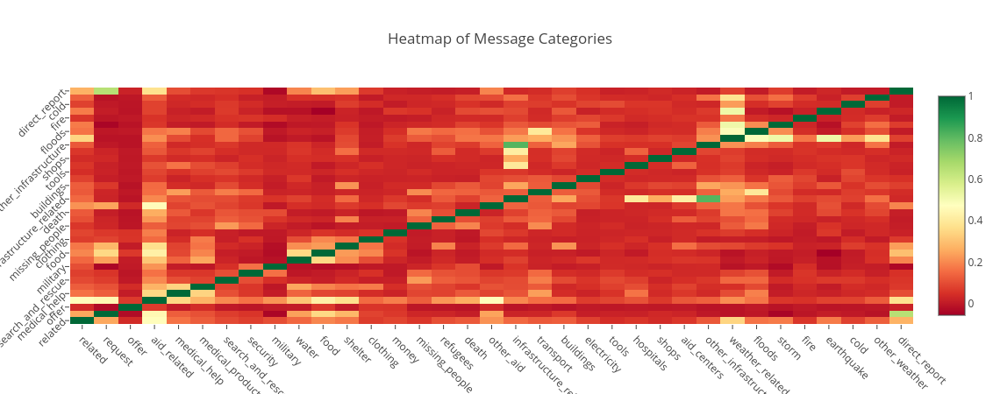

# Disaster Response Pipeline Project

### Purpose

This project is part of the Udacity Data Scientist Nanodegree program. Its purpose is to build
a machine learning pipeline for messages from FigureEight and classify them into different disaster categories.

### Central files

- app/run.py: This file starts the flask web application and contains the plotly visuaisations

- data/process_data.py: This file reads & cleans the data from csv-files and saves them as a sqlite database data/DisasterResponse.db

- model/train_classifier.py: This file creates the machine learning classifier that is used in the web app. To this end, it reads in the data from the sqlite database DisasterResponse.db and trains a MultiOutputClassifier. The final model is saved as a pickle dump model/classifier.pkl. This pickle file will be read in the web app.

### Basic instructions to access the web app

 - Clone the repository and run "python run.py" in the app folder.

 - Copy the suggested link into your browser.

### Further instructions to replicate the pipeline:

Run the following commands in the project's root directory to set up database and model.

    - To run ETL pipeline that cleans data and stores in database
        `python data/process_data.py data/disaster_messages.csv data/disaster_categories.csv data/DisasterResponse.db`
    - To run ML pipeline that trains classifier and saves
        `python models/train_classifier.py data/DisasterResponse.db models/classifier.pkl`

### Usage

To see how the machine learning classifier would classify a message, type the message in the web app input field.

To see summary statistics for the training data, have a look at the plotly visualisations below.

The first plot shows the distribution of message genres.

The second plot shows the distribution of message categories.

The third plot shows a heatmap of correlations among the message categories. The category "child alone" has been removed because it did not contain relevant data. While the general correlation across message categories is week, some patterns are visible, for instance earthquakes are related to floods (possibly due to tsunamis) and infrastructure-related messages are correlated with shops and other infrastructure. 

